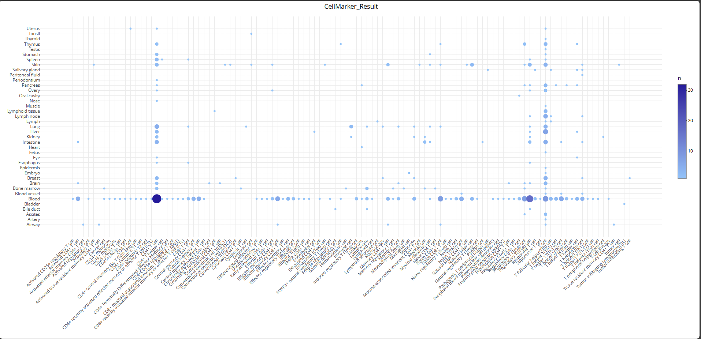
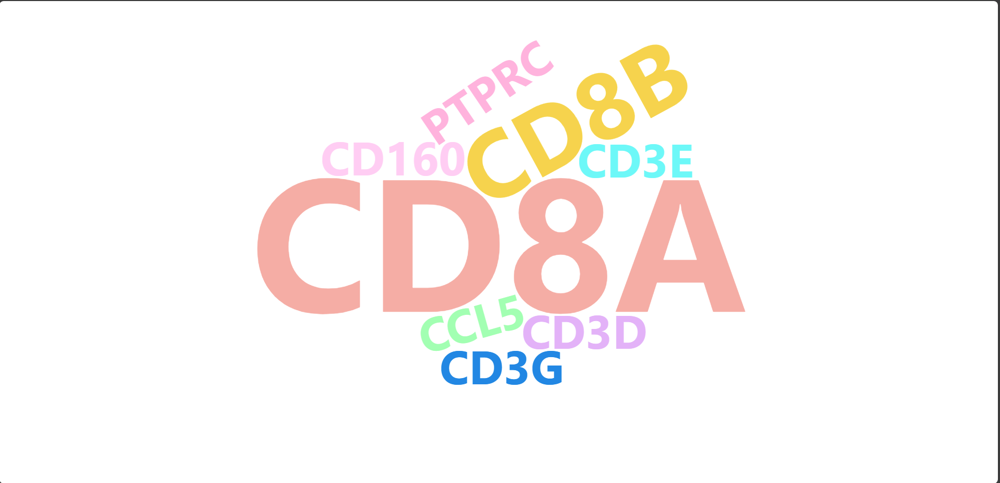

# CellMarkerR

## Description
CellMarkerR is a localized tool that includes two core drawing functions. These functions are based on the database that is publicly available on the CellMarker website.(http://bio-bigdata.hrbmu.edu.cn/CellMarker/CellMarkerSearch.jsp)

## Getting Started

Recommend R language >= 3.6

### Step.1 Install package dependencies

(Option A) Use R language code to install dependent packages.
```
# install.packages()
install.packages(c("plotly","htmlwidgets","wordcloud2","openxlsx"))

# BiocManager::install()
if (!requireNamespace("BiocManager", quietly = TRUE))
    install.packages("BiocManager")
BiocManager::install(c("plotly","htmlwidgets","wordcloud2","openxlsx"))
```

(Option B) Use conda to install dependent packages.
```
conda install -c conda-forge r-plotly r-htmlwidgets r-wordcloud2 r-openxlsx
```

### Step.2 Install the package 

(Option A) Install the package directly from local.
```
install.packages("./CellMarkerR_1.0.0.tar.gz",repos=NULL,type="source")
```

(Option B) Install the package directly from github using the devtools package. 
```
devtools::install_github("KIRA2ZERO/CellMarkerR")
```

### Step.3 Library the package and initialize instance object
```
library(CellMarkerR)
CellMarker = CellMarkerR$new()
```
### Step.4 Use R6 class methods

```
# viewMarker
CellMarker$viewMarker(marker="CD4")
CellMarker$getViewMarkerChartResult()
CellMarker$getViewMarkerTableResult()
CellMarker$saveViewMarkerChartResult(filePath) 
CellMarker$saveViewMarkerTableResult(filePath) 
```



```
# viewCell
CellMarker$viewCell()
CellMarker$getViewCellChartResult()
CellMarker$getViewCellTableResult()
CellMarker$getViewCellRankResult()
CellMarker$saveViewCellChartResult(filePath) 
CellMarker$saveviewCellTableResult(filePath) 
CellMarker$saveviewCellRankResult(filePath) 
```



